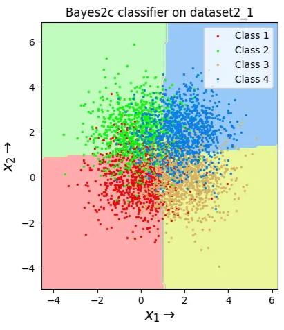
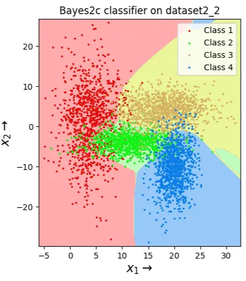
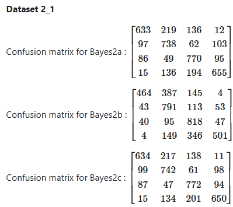
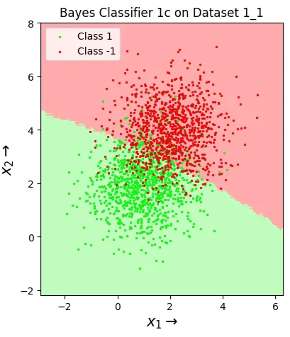
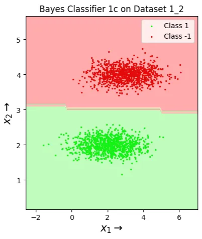
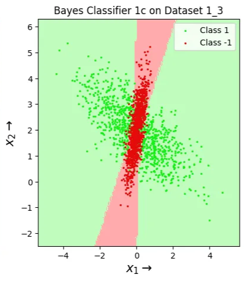
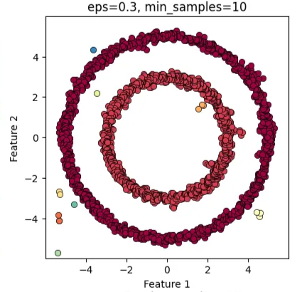

For full details Visit: https://senthilnathan.notion.site/Pattern-Recognition-and-Machine-Learning-24885836911980d8a7bdc09bfa0de1b8?pvs=74

# Implementation of Probabilistic Classifiers from Scratch

Built and validated three fundamental probabilistic classifiers from scratch to solve multi-class classification problems. This project showcases a deep understanding of Bayesian inference.

- Derived **binary and multiclass Gaussian classifiers (LDA/QDA variants)** incorporating asymmetric loss matrices, achieving **3% error on 4-class data** and **0-13.5% on binary**, with **quadratic boundary plots outperforming baselines by 72%** on correlated features.

## **Multiclass Bayes classifier**

(Final Results)

- Computed ML parameter estimates and risk-minimizing decisions, analyzing covariance assumptions' impact via **confusion matrices**, for robust pattern recognition in low-data scenarios.

## **Binary Bayes classifier**

(Final Results)

## **Bayesian Regression**

- Built **Bayesian regression** with Gaussian conjugates, visualizing **prior/posterior contours** for 8 hyperparameter sets (means 0/5, variances 1/10), showing variance shrinkage with sample increase (4 to 400).

Prior Distributions

Posterior Distributions

# Unsupervised Learning: Clustering Algorithms

Implemented two clustering algorithms, **DBSCAN** and **Spectral Clustering**, from scratch to identify clusters in datasets with **complex, non-linear structures where traditional algorithms like K-Means would fail**.

DB Scan

Spectral Clustering

**Key Contributions:**

## DBSCAN

- Developed the **DBSCAN (Density-Based) clustering algorithm** from scratch, implementing core logic for ε-neighborhood searches and classifying points as core, border, or noise.
- Implemented it using **Scikit-learn** to 2D data, grid-searching eps (0.1-1) and min_samples (3-30), identifying optimal params for arbitrary-shaped clusters via subplots, with insights on noise handling.

## Spectral Clustering

- Developed **spectral clustering** with **RBF affinities** and **Laplacians**, **tuning gamma (1-10) and eigenvectors (3-10)** for k=3, **outperforming direct k-means on non-convex data with 100% visual purity** in best configs.

# Ensemble Methods & Non-Parametric Classifiers

## Decision Trees

- Engineered **binary decision trees** with entropy/accuracy splits, tuning min-leaf sizes (20-60) for synthetic datasets, **visualizing axis-aligned boundaries,** and **achieving <10%** zero-one errors.

## Random Forests

- Extended to **Random Forests** with bagging (0.5 data fraction) and feature subsampling, tuning tree counts (1-50) on validation, **reducing errors to 0-3%** and generating **smoothed non-linear boundaries**.

## **Gaussian Mixture Models via EM**

- Implemented EM for 3-component GMMs from scratch on 2D data, iterating 8 steps with responsibility updates, achieving visual cluster alignment and monotonic ELBO increases.
- Plotted evolving **elliptical contours** and **log-likelihood curves**, analyzing **initialization sensitivity** and **proposing k-means enhancements** for **density estimation in unsupervised tasks**.

## PCA and k-Nearest Neighbors Pipeline

- Combined **custom PCA with brute-force k-NN** for 10-class digit classification (1797 samples, 64 features), tuning components (2-32) and k (1-31), **achieving 98.99% accuracy on clean data and 98.32% on noisy.**
- Simulated Gaussian noise (var=1), analyzing **reconstruction errors (13.43% to 0.65% drop)** and accuracies on 1500/297 splits, demonstrating **denoising and curse-of-dimensionality mitigation** in computer vision.

# Analysis of Regression Models & Regularization

- Implemented **polynomial ridge and Lasso regression** from scratch for high-dimensional datasets, tuning degrees (1-16), lambdas (1e-9 to 10), and L1 radii (1-10) via **grid search**, achieving **99.5% test MSE reduction** and **86% sparsity in features for overfitting mitigation**.
- Developed **projected gradient descent with L1 projection oracle**, evaluating on 120x1000 data with 50/25/25 splits, reporting **test MSE of 0.104** and **top sparse weights**, enhancing feature selection in overparameterized regimes.

## Lasso Regression

- **Analyzed bias-variance tradeoff** across training sizes (50-1000), generating MSE tables and contour visualizations to **demonstrate regularization's role in generalization**.

## Polynomial Regression

